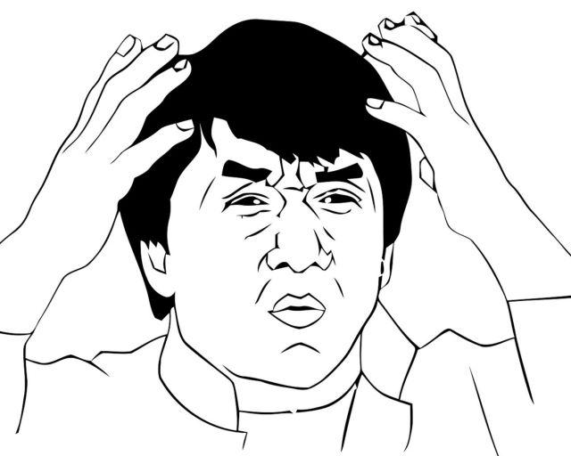

# 🤷‍♂️ What the fresh hell is this? 🤷‍♂️

  
  
  

    These are personal annotations from a Rust tutorial for beginners. 
    The tutorial these notes are based on can be found 
    <a href="https://www.youtube.com/watch?v=OX9HJsJUDxA&list=PLai5B987bZ9CoVR-QEIN9foz4QCJ0H2Y8&index=1">here</a>.
  

 